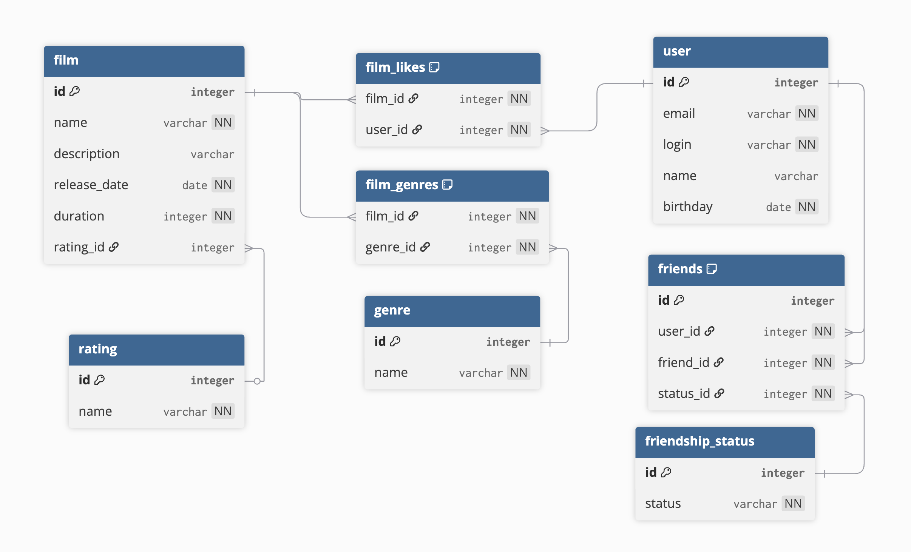

# java-filmorate
Template repository for Filmorate project.

---
## Explanation of the Schema

#### This database stores users, films, genres, ratings, likes, and friendships, with many-to-many relationships handled in separate tables for normalization. Example queries below show how to add users and films, like a film, and get common friends.

## Database Operations Examples

### 1. Adding a User
```sql
INSERT INTO user (email, login, name, birthday)
VALUES ('user1@gmail.com', 'user1', 'name', '2000-01-01');
```
### 2. Adding a Film
```sql
INSERT INTO film (name, releaseDate, duration)
  VALUES ('film1','2000-01-01', 120 );
```

### 3. Adding likes to film
```sql
INSERT INTO film_likes VALUES 1,1;
```
### 4. Get common friends name and login
```sql
SELECT u.name, u.login
FROM user u
WHERE u.id IN (
SELECT f1.friend_id
FROM friends f1
JOIN friendship_status fs1 ON f1.status_id = fs1.id
WHERE f1.user_id = 1 AND fs1.status = 'confirmed'
INTERSECT
SELECT f2.friend_id
FROM friends f2
JOIN friendship_status fs2 ON f2.status_id = fs2.id
WHERE f2.user_id = 2 AND fs2.status = 'confirmed'
);
```
### DSL 
```
Table user {
  id integer [primary key]
  email varchar [not null, unique] 
  login varchar [not null, unique]
  name varchar
  birthday date [not null]
}

Table film {
  id integer [primary key]
  name varchar [not null]
  description varchar
  release_date date [not null]
  duration integer [not null]
  rating_id integer
}

Table rating {
  id integer [primary key]
  name varchar [not null, unique] 
}

Table genre {
  id integer [primary key]
  name varchar [not null, unique]
}

Table film_genres {
  film_id integer [not null]
  genre_id integer [not null]
  
  indexes {
    (film_id, genre_id) [unique] 
  }
}

Table film_likes {
  film_id integer [not null]
  user_id integer [not null]
  
  indexes {
    (film_id, user_id) [unique] 
  }
}

Table friendship_status {
  id integer [primary key]
  status varchar [not null, unique] 
}

Table friends {
  id integer [primary key]
  user_id integer [not null]
  friend_id integer [not null]
  status_id integer [not null]

  indexes {
    (user_id, friend_id) [unique]
  }
}

Ref: film.rating_id > rating.id
Ref: film_genres.film_id > film.id
Ref: film_genres.genre_id > genre.id
Ref: film_likes.film_id > film.id
Ref: film_likes.user_id > user.id
Ref: friends.user_id > user.id
Ref: friends.friend_id > user.id
Ref: friends.status_id > friendship_status.id
```
